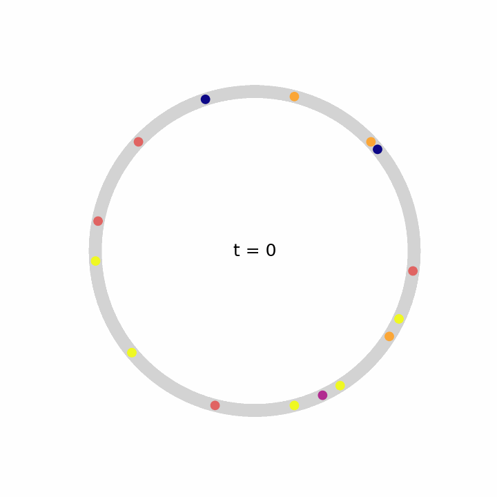
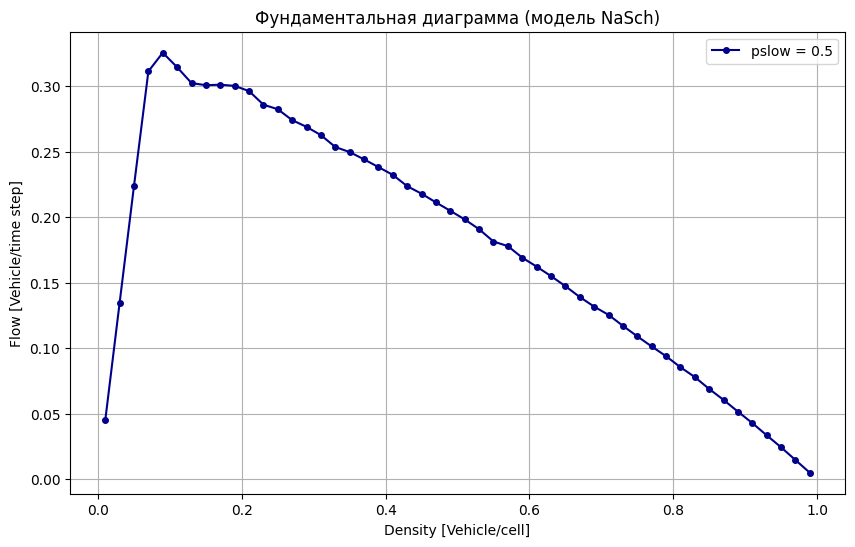
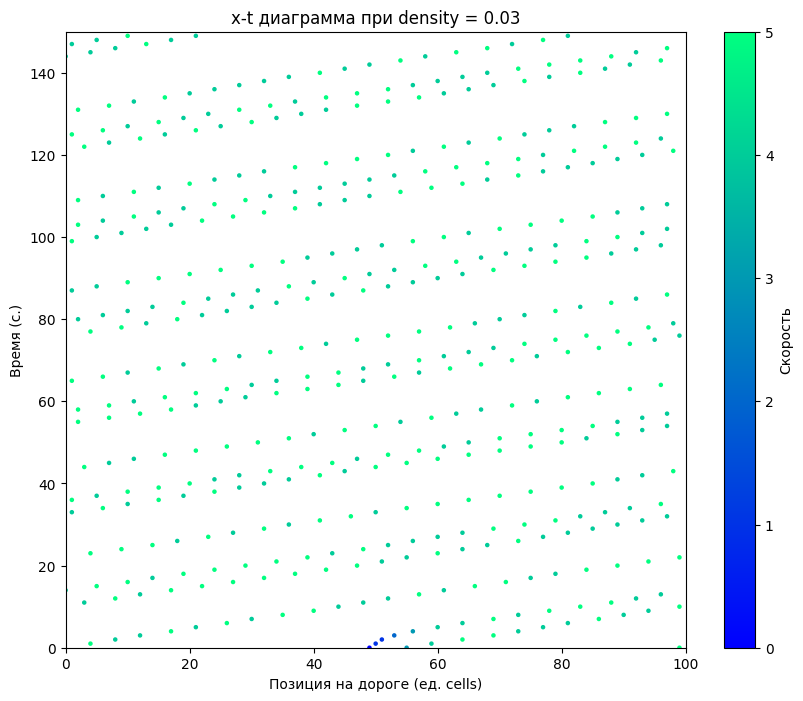
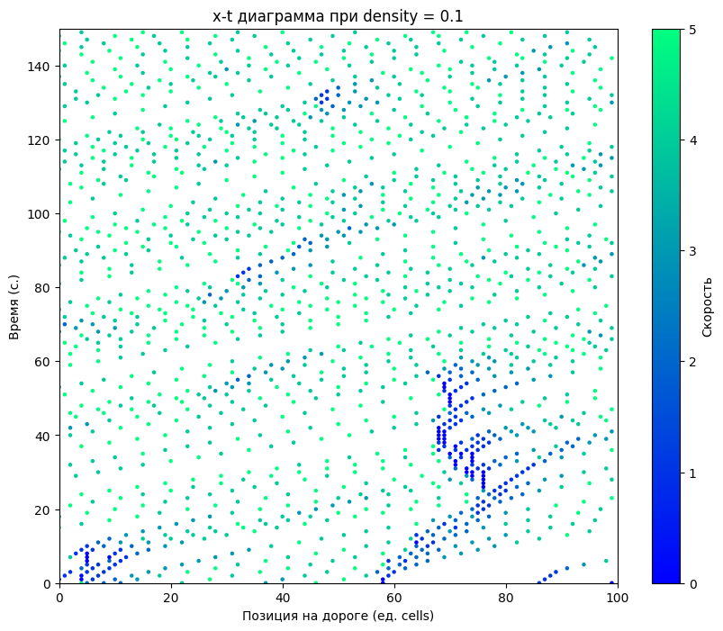
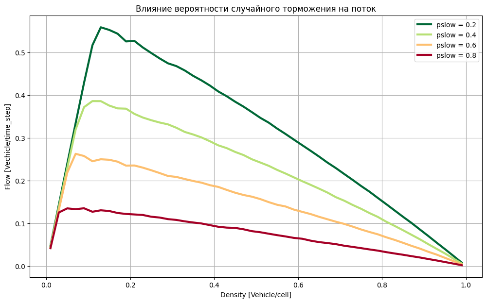
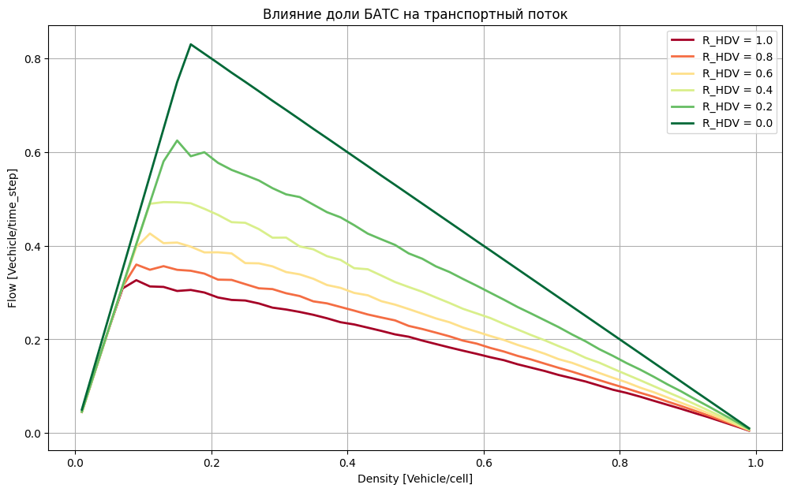
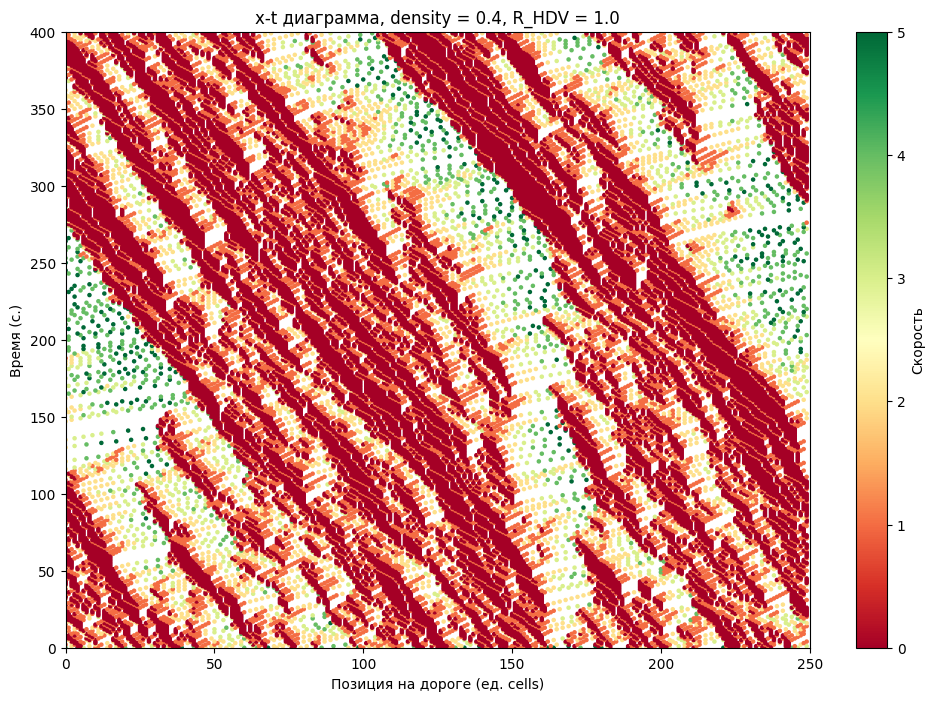
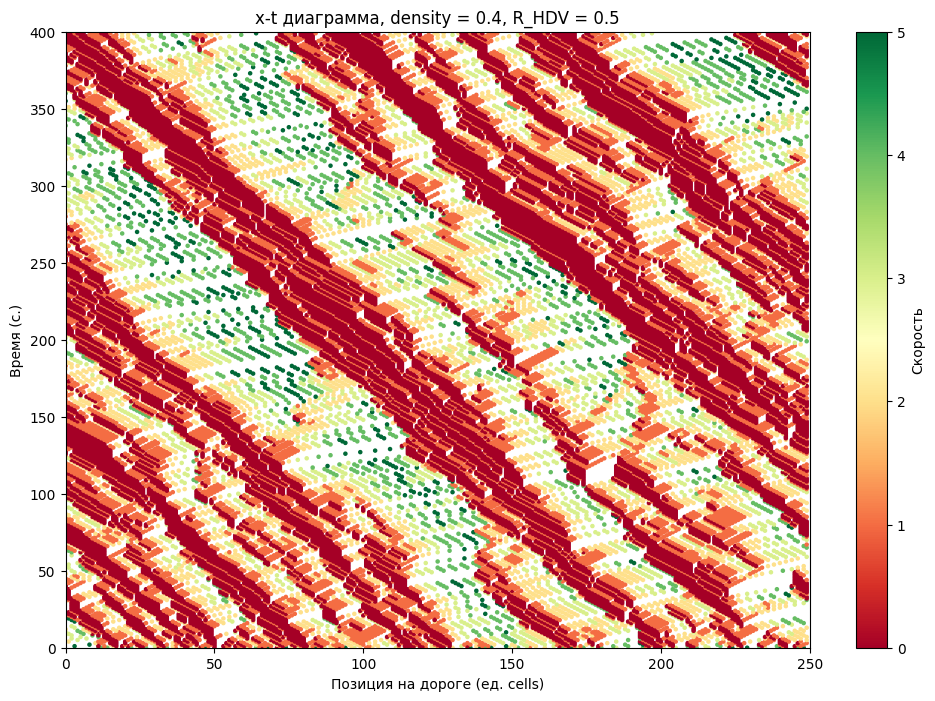
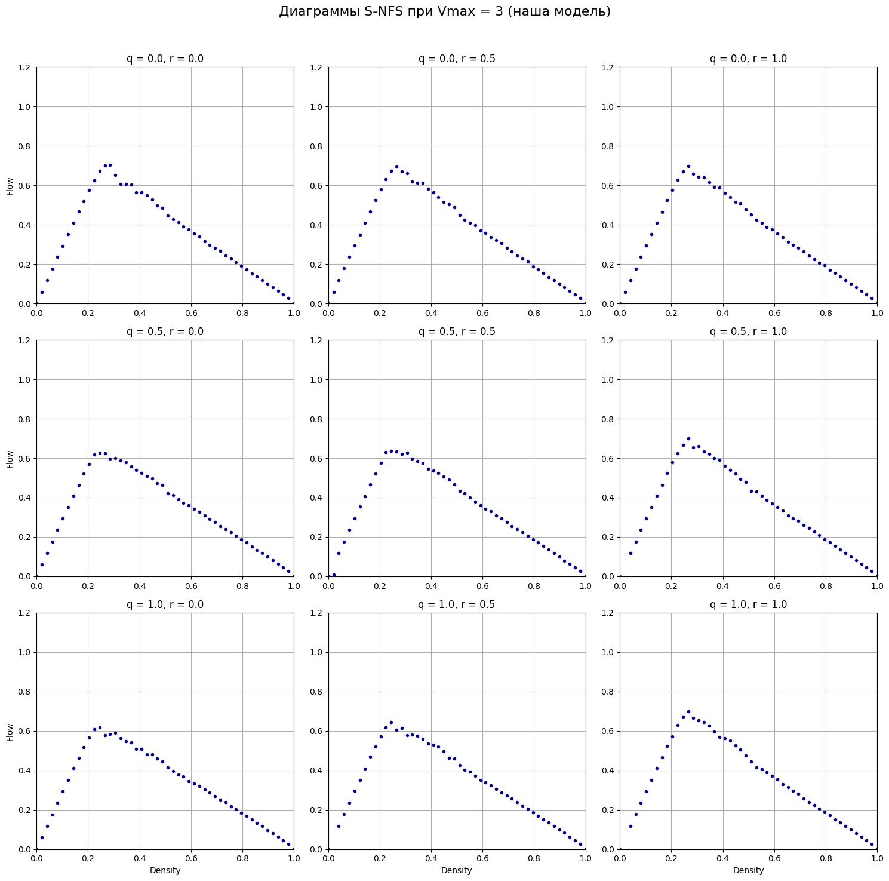
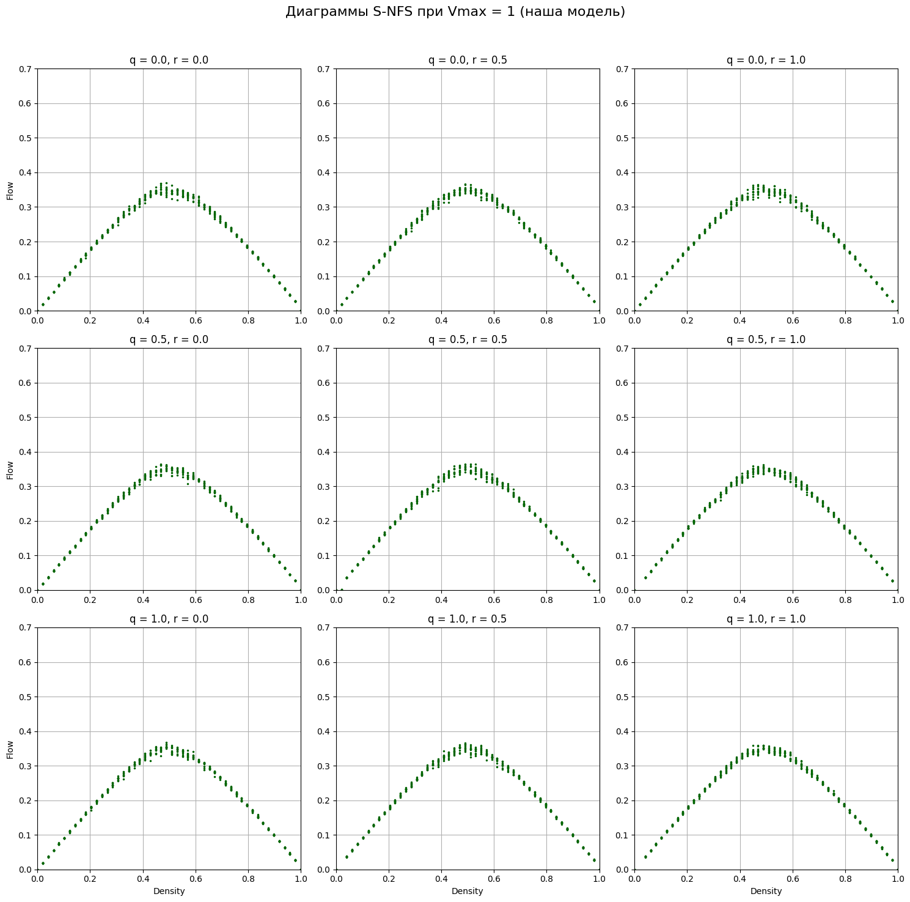

# 🚗 Модели транспортного потока на клеточных автоматах

<a href="https://github.com/diam0voi/lab1v4_forest_model/blob/main/LICENSE">
  
</a>

Данный проект представляет собой реализацию и исследование дискретных моделей транспортных потоков с использованием клеточных автоматов. Основная цель — воспроизвести и проанализировать поведение транспортных систем при различных условиях, напрямую воздействующих на плотность потока и иные базовые параметры.



В работе реализованы две ключевые модели:
1.  **Модель Нагеля и Шрекенберга (NaSch)** — базовая стохастическая модель, описывающая возникновение заторов как явление.
2.  **Модель S-NFS** — усложненная модель, учитывающая эффекты "медленного старта" и "упреждения" водителем.

### 📎 1. Модель Нагеля и Шрекенберга (NaSch)

Эта модель симулирует движение автомобилей по однополосной кольцевой дороге. Поведение водителей определяется четырьмя простыми правилами: ускорение, торможение из-за препятствия, случайное торможение и движение.

#### 💡 Фундаментальная диаграмма:



Диаграмма показывает зависимость потока от плотности. Результаты моделирования хорошо согласуются с теоретическими данными: наблюдается фазовый переход от свободного потока к плотному (затору) при достижении критической плотности.

#### Пространственно-временные (x-t) диаграммы

Эти диаграммы визуализируют траектории автомобилей во времени.
-   **При низкой плотности (0.03)** поток свободный, траектории — параллельные линии.
-   **При высокой плотности (0.1)** начинают формироваться "волны" заторов, которые распространяются в направлении, противоположном движению потока.

| Плотность 0.03 (Свободный поток) | Плотность 0.1 (Начало заторов) |
| :------------------------------: | :------------------------------: |
|  |  |

### 🤖 2. Исследование влияния параметров и БАТС в модели NaSch

#### Влияние вероятности случайного торможения (p_slow)

С уменьшением вероятности случайного торможения (т.е. водители становятся более "идеальными") максимальная пропускная способность дороги увеличивается, а пик потока сдвигается в сторону более высоких плотностей.



#### 🕒 Влияние доли БАТС

Беспилотники (Бесплитоные Автомобильные Транспортные Средства) в данной модели не совершают случайных торможений. Увеличение их доли в потоке (`R_HDV` -> 0) значительно повышает эффективность транспортной системы. При 100% БАТС (`R_HDV=0.0`) диаграмма стремится к идеальной треугольной форме.



#### 🚦 Сравнение заторов при наличии БАТС

При высокой плотности в потоке, состоящем только из людей-водителей, образуются крупные, стабильные заторы. Добавление 50% БАТС "разрушает" эти структуры, делая поток более хаотичным, но при этом повышая среднюю скорость и уменьшая глубину заторов.

| Плотность 0.4 (100% люди) | Плотность 0.4 (50% БАТС) |
| :------------------------------: | :------------------------------: |
|  |  |

### 🖇3. Модель S-NFS

Эта модель является расширением NaSch и добавляет более реалистичные аспекты поведения водителей, такие как медленный старт после остановки и оценка дорожной ситуации на несколько машин вперёд.



#### 📈 Результаты при V_max = 3

Серия диаграмм показывает, как меняется транспортный поток в зависимости от вероятности медленного старта (`q`) и вероятности упреждения (`r`).



#### 📉 Результаты при V_max = 1

При низкой максимальной скорости модель демонстрирует наличие **метастабильных состояний**. Поток может долгое время находиться на верхней "ветке" диаграммы (свободное движение), прежде чем флуктуации вызовут каскадный сбой и переход в состояние затора (нижняя ветка).

## 📂 Структура репозитория
```
.
│
├── assets/
│   ├── plots/
│   │   ├── naSch_base.png
│   │   ├── naSch_density_full_rhdv.png
│   │   ├── naSch_density_half_rhdv.png
│   │   ├── naSch_nonrhdv_ratio.png
│   │   ├── naSch_p_slow_ratio.png
│   │   ├── naSch_x-t_0.1.png
│   │   ├── naSch_x-t_0.03.png
│   │   ├── s-nfs_v_max_1.png
│   │   └── s-nfs_v_max_3.png
│   └── GIF/
│       └── traffic_simulation.gif
├── src/
│   └── trafficflow_advanced_models.ipynb
├── .gitignore
├── LICENSE
└── README.md
```
